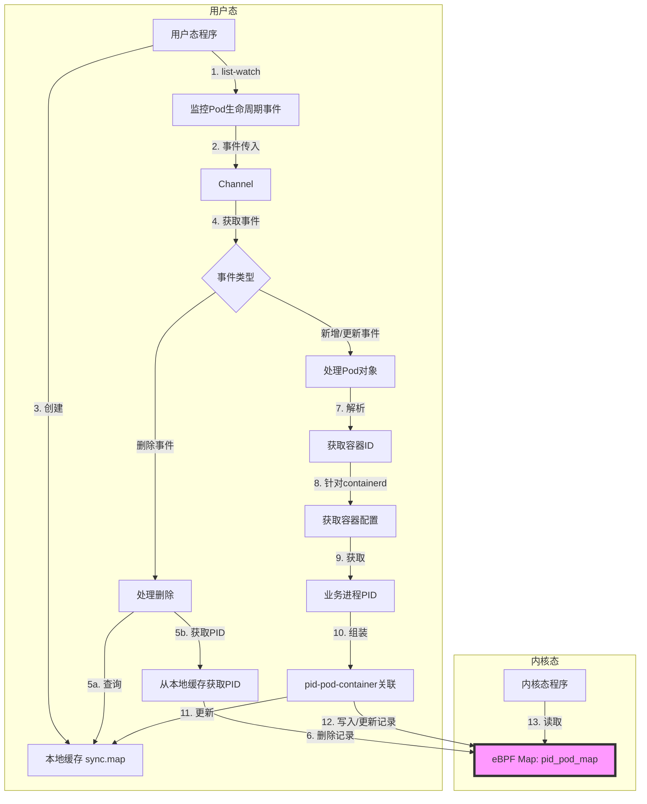
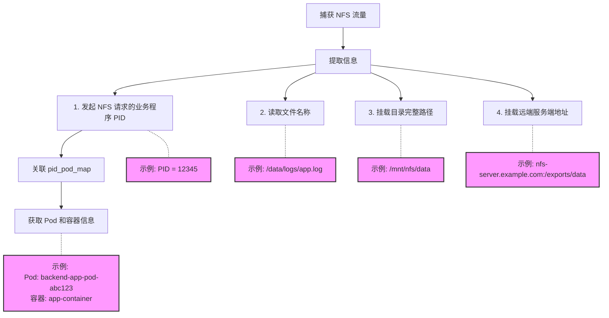
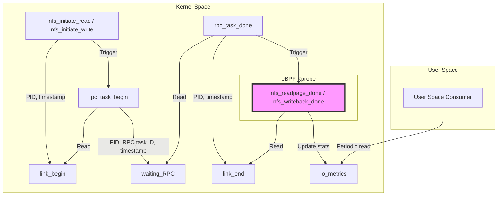

# 前言

在上一篇《eBPF 治理 NFS 存储的尝试》文章中，尝试解决 Kubernetes 集群场景下，如何采集 NFS 流量性能指标。上一篇主要还是设计阶段，还仅停留在对于关键技术点上的验证，还没有跑通全流程，也还没有着手实现一个组件来解决提出的问题。那本篇文章主要介绍落地上一篇文章过程中遇到的一些问题，以及对于 NFS 性能监控完整方案的介绍。

# NFS 流量追踪

## 搜索内核挂载点

《eBPF 治理 NFS 存储的尝试》 中列举出 `kprobe/nfs4_read_done_cb`等 5 个挂载点，在测试过程中发现 `rpc_task`、`kiocb` 数据结构满足需求，前面5个挂载点只是调用链路上一个点。那是不是可以用入参的数据结构（比如 `rpc_task`）为索引，在整个 `/proc/kallsyms` 中找到所有拥有该参数的挂载点呢？看过《cilium/pwru 源码分析》系列文章的兄弟们是不是感觉这个思路很耳熟。没错，pwru 的主要思路就是以 `sk_buff` 作为搜索条件，找到所有网络包在传输过程中的所有链路节点。

## 找不到 NFS 内核函数？

在抄 pwru 项目的时候发现，有的操作系统（比如：KY10 SP3）虽然开启了 BTF，BTF 文件也存在，但是内核模块的 BTF 文件不存在。NFS 大部分操作系统编译内核的时候都不会直接进内核，也就是 `/sys/kernel/btf/vmlinux` 中并不包含 NFS 的内核函数信息。这里回顾下 pwru 是如何获取过滤出想要的内核函数的：

1. 从 `/sys/kernel/btf/vmlinux` 文件拿到 `In-kernel` 所有内核函数、函数入参、数据结构描述、数据类型定义等信息。
2. 遍历 `/sys/kernel/btf` 目录，读取所有内核模块的 BTF 文件，获取信息跟上面的是一样的。
3. 遍历前面两步拿到的所有内核函数，检查所有入参的数据类型，匹配的存入数组。

那梳理到这里，解决这个问题也就只有两种方法了：

1. 找到或者自己生成内核模块对应的 BTF 文件。
2. 在其他拥有内核模块的操作系统，找到需要的内核函数以及入参索引，手动插入到上面的匹配数组中。

### 生成BTF

使用 `pahole -J` 命令从包含 DWARF 调试信息的 ELF 文件（通常在 `debuginfo` RPM 包中）生成 BTF 文件。以下是如何进行操作的详细步骤：

**安装 `debuginfo` 包**

以 KY10 为例可以到 `https://update.cs2c.com.cn/NS/V10/V10SP3/os/adv/lic/base/aarch64/debug` 找到对应版本的 debuginfo 包，当然很有可能是找不到对应的包，那就直接放弃这个方法吧。

**找到包含 DWARF 信息的 ELF 文件**

可以使用 `rpm -qlp nfs-utils-debuginfo-2.4.3-0.oe1.aarch64.rpm` 从 RPM 包中找到对应的问题。

```bash
warning: nfs-utils-debuginfo-2.4.3-0.oe1.aarch64.rpm: Header V3 RSA/SHA1 Signature, key ID b25e7f66: NOKEY
...
/usr/lib/debug/sbin/mount.nfs-2.4.3-0.oe1.aarch64.debug
...
/usr/lib/debug/usr/lib/systemd/system-generators/rpc-pipefs-generator-2.4.3-0.oe1.aarch64.debug
...
/usr/lib/debug/usr/lib64/libnfsidmap/umich_ldap.so-2.4.3-0.oe1.aarch64.debug
...
/usr/lib/debug/usr/sbin/sm-notify-2.4.3-0.oe1.aarch64.debug
```

**使用 `pahole` 生成 BTF 文件**

一旦找到包含 DWARF 信息的 ELF 文件，可以使用 `pahole` 工具生成 BTF 文件。命令如下：

```bash
pahole -J /usr/lib/debug/path/to/your/file.debug
```

这里的 `/usr/lib/debug/path/to/your/file.debug` 是包含 DWARF 调试信息的 ELF 文件路径。

**验证生成的 BTF 文件**

生成的 BTF 文件通常会被存储在当前目录下，文件名与输入文件相同，只是扩展名为 `.btf`。可以使用 `bpftool` 工具来检查 BTF 文件的内容：

```bash
bpftool btf dump file file.btf
```

**将 BTF 文件应用到系统中**

可以将其复制到 `/sys/kernel/btf/` 目录下，或者直接由程序加载。

很不幸，经过测试使用 `pahole` 工具可以正常生成 BTF 文件，校验也能通过，但是最后读取过程中是失败了。理论上这种方法该是可行的，后续再花时间跟进下这个问题。

### 手动添加

增加 `-add-funcs` 参数，通过命令行手动添加内核模块关注的内核函数名称，以及关注的入参（比如：`kiocb`）在第几个参数，示例如下：
`-add-funcs="nfs_file_direct_read:1,nfs_file_direct_write:1,nfs_swap_rw:1,nfs_file_read:1,nfs_file_write:1"`。

在完成内核函数过滤之后，手动合并到过滤之后的列表，示例代码如下：

```go
	// add functions
	if len(addFuncs) != 0 {
		funcs = internal.MergerFunList(funcs, addFuncs)
	}
```

## 信息关联

### PID、POD 关联




《eBPF 治理 NFS 存储的尝试》关于信息关联提出来两个思路，方案设计初期是侧重在内核态完成关联，但是后期落地过程中考虑到降低内核态的业务负担，最后还是决定将 pid-pod-container 的关联逻辑放到用户态程序实现，也就是对应的思路一里面的实现方式。拿到关联关系需要解决以下的问题：

***如何感知当前节点容器生命周期的变化？***

1. 通过 list-watch 机制监控当前节点 Pod 生命周期事件，将所有事件按照类型传入 channel 中。

2. 本地创建 `sync.map` 缓存对象，key 为容器ID，value 为PID。

   本地缓存存在的意义在于，删除数据时不需要从用户态到内核态查询 map 信息了。

3. 针对Pod 删除事件，删除缓存中的记录。

4. 针对Pod 新增/更新事件，新增记录到缓存。

*** 如何匹配 pid-pod-container 关联关系？***

1. 从 channel 中获取当前需要处理的 Pod 对象。

2. 从 Pod 对象  `status.containerId`  中解析出容器 ID。

   ```go
   		// 移除可能的前缀
   		containerID := status.ContainerID
   		containerID = strings.TrimPrefix(containerID, "docker://")
   		containerID = strings.TrimPrefix(containerID, "containerd://")
   ```

3. 针对 containerd cri，加载`/run/containerd/containerd.sock`文件，并创建客户端，通过 containerID 获取到容器的配置，从配置中获取 PID。

4. 至此，获取到 容器ID、Pod名字、容器名字、业务进程PID。

*** 如何让内核态感知关联关系？***

1. 创建 eBPF map `pid_pod_map` ，类型 `BPF_MAP_TYPE_HASH` ，key 为 PID，value 为 `metadata`

```c
struct metadata
{
    char pod[100];
    char container[100];
    u64 pid;
};
```


2. 针对Pod 新增/更新事件，查询到 pid-pod-container  关联关系之后，从用户态将关联信息写入到内核态  eBPF map `pid_pod_map` 。
3. 针对 Pod 删除事件，从本地缓存中查询容器ID对应的PID，从内核态 map `pid_pod_map` 中删除记录。
4. 这里需要处理删除事件，也是考虑 `BPF_MAP_TYPE_HASH` 会被写满的问题。

### PID、文件关联




PID 与 文件之间的关联主要在捕获到 NFS 流量之后需要实现的，目标是获取到当前 NFS 流量的以下信息：

1. 发起 NFS 请求的业务程序 PID
   示例：PID = 12345
   解释：这个 PID 可以通过 eBPF 程序在捕获 NFS 请求时获取。使用这个 PID，我们可以查询之前创建的 `pid_pod_map` 来获取相关的 Pod 和容器信息。

2. 读取文件名称
   示例：/logs/app.log
   解释：这个信息可以从 NFS 请求的数据包中提取。NFS 协议中包含了文件操作的详细信息，包括文件路径。

3. 挂载目录完整路径
   示例：/mnt/nfs/data
   解释：这个信息通常在系统的挂载表中可以找到。可以通过解析 /proc/mounts 文件或使用 mount 命令的输出来获取。

4. 挂载远端服务端地址
   示例：nfs-server.example.com:/exports/data
   解释：这个信息也可以从系统的挂载信息中获取。它包括 NFS 服务器的主机名或 IP 地址，以及服务器上导出的文件系统路径。

示例输出如下：

```
NFS 操作记录：
- PID: 12345
- Pod: backend-app-pod-abc123
- 容器: app-container
- 操作文件: /logs/app.log
- 本地挂载路径: /mnt/nfs/data
- 远端 NFS 服务器: nfs-server.example.com:/exports/data
```

#### 总流程

**PID 获取**

使用 `bpf_get_current_pid_tgid()` 函数获取当前进程的 PID：

```c
event.pid = bpf_get_current_pid_tgid() >> 32;
```

**容器元数据关联**

通过 `pid_cgroup_map` 查找与 PID 相关的容器元数据：

```c
struct metadata *metadata = bpf_map_lookup_elem(&pid_cgroup_map, &event.pid);
if (metadata) {
    bpf_probe_read_kernel(&event.pod, sizeof(event.pod), metadata->pod);
    bpf_probe_read_kernel(&event.container, sizeof(event.container), metadata->container);
}
```

这一步建立了 PID 与容器（Pod 和 Container）的关联。

**文件信息获取**

从 `kiocb` 结构体开始，逐步获取文件相关信息：

1. 获取 `struct file` 指针：

   ```c
   struct file *file = BPF_CORE_READ(iocb, ki_filp);
   ```

2. 获取 `struct path`：

   ```c
   struct path fp = BPF_CORE_READ(file, f_path);
   ```

3. 获取 `struct dentry`：

   ```c
   struct dentry *de = BPF_CORE_READ(&fp, dentry);
   ```

4. 获取完整文件路径：

   ```c
   int len = get_full_path(de, event.file, sizeof(event.file));
   ```

**挂载点信息获取**

1. 获取 `struct vfsmount`：

   ```c
   struct vfsmount *vfsmnt = BPF_CORE_READ(&fp, mnt);
   ```

2. 获取 `struct mount`：

   ```c
   struct mount *mnt = container_of(vfsmnt, struct mount, mnt);
   ```

3. 获取挂载 ID：

   ```c
   event.mount_id = BPF_CORE_READ(mnt, mnt_id);
   ```

4. 数据输出

收集的信息通过 perf 事件数组输出：

```c
bpf_perf_event_output(ctx, &rpc_task_map, BPF_F_CURRENT_CPU, &event, sizeof(event));
```

5. 关联关系总结

- PID → 容器信息：通过 `pid_cgroup_map` 建立
- PID → 文件名称：通过 `get_full_path` 函数从 dentry 获取
- PID → 文件目录：文件名称的一部分，同样通过 `get_full_path` 获取
- PID → 挂载点：通过 `mount` 结构体的 `mnt_id` 标识

#### get_full_path

`get_full_path` 方法是获取文件完整路径的核心函数。这个函数通过遍历 dentry 结构来构建完整的文件路径。以下是对该方法的详细分析：

**函数签名**

```c
static __always_inline int get_full_path(struct dentry *dentry, char *path, int buf_size)
```


参数说明：

- `dentry`: 文件系统中表示目录项的结构体指针
- `path`: 用于存储生成的路径的字符数组
- `buf_size`: `path` 数组的大小

**实现逻辑**

1. **初始化**:

   ```c
   int offset = buf_size - 1;
   path[offset] = '\0';
   ```

   从缓冲区末尾开始，确保字符串以 null 结尾。

2. **遍历 dentry 链**:

   ```c
   #pragma unroll
   for (int i = 0; i < 10; i++) {
       // ... 循环体 ...
   }
   ```

   使用有限循环（最多10次）来防止无限循环，这是 eBPF 程序的要求。

3. **获取当前 dentry 名称**:

   ```c
   struct qstr dname;
   if (bpf_probe_read_kernel(&dname, sizeof(dname), (void *)&dentry->d_name) < 0)
       break;
   ```

   读取当前 dentry 的名称。

4. **复制名称到路径缓冲区**:

   ```c
   int name_len = 30;
   if (name_len > offset)
       name_len = offset;
   if (offset < name_len)
       break;
   offset -= name_len;
   if (bpf_probe_read_kernel(&path[offset], name_len, (void *)dname.name) < 0)
       break;
   ```

   将 dentry 名称复制到路径缓冲区，同时处理缓冲区大小限制。

5. **添加路径分隔符**:

   ```c
   if (offset > 0 && path[offset] != '/') {
       offset--;
       path[offset] = '/';
   }
   ```

   确保路径组件之间有正确的分隔符。

6. **移动到父 dentry**:

   ```c
   struct dentry *parent;
   if (bpf_probe_read_kernel(&parent, sizeof(parent), &dentry->d_parent) < 0)
       break;
   if (dentry == parent)
       break;
   dentry = parent;
   ```

   获取并移动到父 dentry，直到达到根目录。

**与 PID 和文件信息关联**

这个函数是建立 PID 与文件路径关联的关键。通过在 `kprobe_nfs_kiocb` 函数中调用 `get_full_path`，我们能够：

1. 获取与当前 PID 相关的文件的完整路径。
2. 将这个路径信息与其他收集的数据（如 PID、容器信息、挂载点 ID 等）关联起来。
3. 通过 perf 事件将这些关联的信息输出，供用户空间程序进一步处理和分析。

这种方法允许我们准确地追踪每个 NFS 操作涉及的具体文件路径，从而提供了 PID、文件路径和 NFS 操作之间的详细关联信息。

### PID、挂载点关联

在复杂的生产环境中，NFS 流量追踪面临多元化存储需求的挑战。多个 NFS 服务器通常同时承载着应用数据、日志、配置、备份和临时文件等不同类型的存储。因此，实时准确地将挂载点映射到相应的 NFS 服务器变得至关重要，这不仅能够精确定位数据流向，还能有效区分和管理不同类别的存储资源，从而提高整体系统的可观测性和管理效率。

#### 关于为什么需要进行实时映射？

在容器化的环境中，eBPF 程序需要实时查询 mount_id 的原因主要是为了应对容器环境的高度动态性和确保数据的准确性。容器可以快速创建、销毁或重启，卷可以动态挂载和卸载，这些操作都可能导致 mount 信息的变化。mount_id 作为内核为每个挂载点分配的唯一标识符，在容器内部可能与主机上的不同，且会随着容器或挂载点的变化而改变。

eBPF 程序通常在系统调用级别工作，需要实时获取 mount_id 来正确解释文件操作，如果使用缓存的 mount 信息，可能会导致错误的文件路径解析。考虑到容器的隔离性，容器有自己的挂载命名空间，主机上看到的挂载信息会与容器内部不同，因此需要实时查询来获取容器特定的挂载信息。

总的来说，在容器化环境中实时查询 mount_id 是确保 eBPF 程序能够准确理解和追踪文件操作的关键，它允许系统适应快速变化的容器环境，提供准确的监控和审计信息。

#### 文件关联

在容器化环境中，`/proc/PID/mountinfo` 文件提供了获取特定容器挂载信息的有效方法。这是因为每个容器都运行在其own独立的挂载命名空间中，而 `/proc/PID/mountinfo` 反映了该特定进程（在这种情况下是容器进程）所见的挂载视图。通过读取容器主进程对应的 mountinfo 文件，我们能够准确获取容器内部的挂载状态，包括 NFS 挂载点在内的所有文件系统挂载信息。这种方法之所以有效，是由于 Linux 内核的进程隔离机制确保了每个容器都有自己的 /proc 视图，从而使得通过宿主机上的 /proc 文件系统，我们可以窥探到容器内部的文件系统结构，而无需进入容器本身。

通过一个示例来详细说明 `/proc/PID/mountinfo` 的格式。让我们看一个典型的条目:

```text
36 35 98:0 /mnt1 /mnt2 rw,noatime master:1 - ext3 /dev/root rw,errors=continue
```

现在让我们逐字段解析这个示例:

1. 挂载 ID: 36
   这是这个特定挂载的唯一标识符。

2. 父挂载 ID: 35
   表示这个挂载点的父挂载。

3. 主设备号:次设备号: 98:0
   这标识了被挂载的设备。

4. 根目录: /mnt1
   这是挂载点在其文件系统中的根目录。

5. 挂载点: /mnt2
   这是文件系统被挂载到的目录。

6. 挂载选项: rw,noatime
   rw 表示读写模式,noatime 表示不更新文件的访问时间。

7. 可选字段: master:1
   这是一个可选的字段,提供额外信息。

8. 分隔符: -
   用于分隔可选字段和剩余字段。

9. 文件系统类型: ext3
   表示这是一个 ext3 文件系统。

10. 挂载源: /dev/root
    这是被挂载的设备。

11. 超级块选项: rw,errors=continue
    这些是文件系统特定的选项。

#### 监听文件

要感知 Linux 系统中 `/proc/PID/mountinfo` 文件的变化,我们可以使用几种方法。以下是一些常用的方法:

**使用 inotify 机制**

inotify 是 Linux 内核提供的一种文件系统事件监控机制。我们可以使用它来监视 `/proc/PID/mountinfo` 文件的变化。

要使用 Golang 实现对 `/proc/PID/mountinfo` 文件的 inotify 监控,可以使用 `github.com/fsnotify/fsnotify` 库。**但是由于 procfs 的特性导致无法被 inotify 捕获。**

> ### Why don't notifications work with NFS, SMB, FUSE, /proc, or /sys?
>
>
>
> fsnotify requires support from underlying OS to work. The current NFS and SMB protocols does not provide network level support for file notifications, and neither do the /proc and /sys virtual filesystems.
>
> This could be fixed with a polling watcher ([#9](https://github.com/fsnotify/fsnotify/issues/9)), but it's not yet implemented.

**定期检查文件内容**

另一种方法是定期读取 `/proc/PID/mountinfo` 文件的内容,并与上一次读取的内容进行比较。这种方法虽然不如 inotify 实时,但实现起来更简单,而且跨平台性更好。

每秒钟读取一次 `/proc/PID/mountinfo` 文件,并将其内容与上一次读取的内容进行比较。如果发现变化,它会打印一条消息。可以根据需要调整检查的频率和处理逻辑。


## NFS 性能指标

当前性能指标方案主要思路来源于 《[TrackIops : Real-Time NFS Performance Metrics Extractor](https://perso.ens-lyon.fr/theophile.dubuc/files/CHEOPS24-TrackIOps.pdf)》，这篇论文主要介绍了一个名为TrackIops的工具,用于实时提取NFS(网络文件系统)性能指标。以下是论文的主要内容:

1. TrackIops的设计:
    - 基于eBPF(扩展的Berkeley Packet Filter)技术:这允许在内核中安全高效地执行代码,而无需修改内核源代码。
    - 客户端侧追踪:这意味着不需要修改或访问NFS服务器,使得该解决方案更加通用和易于部署。
    - 面向请求的追踪:TrackIops跟踪每个NFS请求,从发起到完成,以提供准确的性能指标。
    - 内核中的请求重建:TrackIops在内核中重建NFS请求和响应线程,这减少了用户空间和内核空间之间的数据传输,从而提高效率。
    - 在线分析:性能数据在收集时就进行分析,而不是事后处理,这使得TrackIops能够提供实时指标。
    - 提供每租户、每文件、每秒的NFS指标:这正是云服务提供商和客户所需要的细粒度级别。
2. 主要特点:
    - 无需服务器端插装:TrackIops完全在客户端运行,不需要修改或访问NFS服务器。这使得它可以与任何NFS服务器一起使用,包括那些不允许修改的闭源商业解决方案。
    - 低开销:即使在最坏情况下,TrackIops在客户端的性能开销也低于3.5%。这意味着它可以在生产环境中持续运行,而不会显著影响系统性能。
    - 易于集成:TrackIops提供的指标可以轻松集成到任何优化或故障排除解决方案中。它生成标准化的指标,可以被各种分析工具和系统使用。
3. 评估:
    - 性能开销:即使在最坏情况下(本地NFS服务器,高I/O强度工作负载),TrackIops的开销也低于3.5%。
    - 影响因素:评估考虑了几个可能影响开销的因素,包括NFS服务器性能、NFS请求频率、跟踪粒度和同时活动的文件数量。
    - 数据生成量:在最细粒度的设置下(1秒间隔,4000个同时打开的文件),TrackIops每天生成不到13 GiB的数据,这在云提供商的生产环境中是可以接受的。

当前，落地过程中还是遇到一些问题，比如：nfs_readpage_done 挂载不存在、nfs_writeback_done  与 nfs_initiate_read 中获取的 PID 不一致、内核跟踪点有 Tracepoint 切换到 Kprobe 等问题，这些问题的解决方案都会在后续方案中介绍。

### 整体方案

1. 整体架构：
   TrackIops 由两个主要部分组成：

    - 内核空间代理（基于eBPF）
    - 用户空间消费者

2. eBPF 内核代理：

    - 使用 eBPF（扩展的 Berkeley Packet Filter）技术
    - 附加到 NFS 和 RPC（远程过程调用）的内核跟踪点
    - 在内核中收集数据并重建 NFS 请求

3. 数据收集点：
   TrackIops 在以下跟踪点收集数据：

    - nfs_initiate_read: NFS 读请求开始
    - nfs_initiate_write: NFS 写请求开始
    - rpc_task_begin: RPC 任务开始
    - rpc_task_done: RPC 任务结束
    - nfs_readpage_done: NFS 读请求完成
    - nfs_writeback_done: NFS 写请求完成

4. NFS 请求重建：

    - 利用 RPC 子系统和其任务 ID 作为 NFS 请求开始和结束跟踪点之间的中介
    - 使用进程 ID（PID）和 RPC 任务 ID 来链接相关事件

5. 内核中的数据处理：

    - 使用 BPF 哈希表存储临时信息
    - 在内核中进行请求重建，最小化内核和用户空间之间的数据移动

6. 指标计算：
   收集以下原始数据：

    - 读/写操作计数
    - 读/写累积大小
    - 读/写累积延迟

   这些数据用于计算：

    - IOPS（每秒 I/O 操作数）
    - 吞吐量（每秒读/写大小）
    - 延迟（平均 I/O 请求响应时间）

7. 用户空间消费者：

    - 定期从内核 BPF 哈希表中读取数据
    - 将原始数据转换为实际存储指标
    - 将数据写入管道供外部服务使用

### 数据存储

在这个 eBPF 程序中，涉及到 NFS 流量指标的 map 数据存储主要有以下几种：

1. **`link_begin`**:
    - 类型: `BPF_MAP_TYPE_HASH`
    - 键: `u32` (PID)
    - 值: `u64` (时间戳)
    - 用途: 存储 NFS 读/写操作开始的时间戳。
2. **`waiting_RPC`**:
    - 类型: `BPF_MAP_TYPE_HASH`
    - 键: `u64` (RPC 任务 ID)
    - 值: `struct rpc_task_info` (包含时间戳、PID 和 TID)
    - 用途: 存储等待处理的 RPC 任务信息。
3. **`link_end`**:
    - 类型: `BPF_MAP_TYPE_HASH`
    - 键: `u32` (PID)
    - 值: `u64` (时间戳)
    - 用途: 存储 NFS 读/写操作结束的时间戳。
4. **`io_metrics`**:
    - 类型: `BPF_MAP_TYPE_HASH`
    - 键: `u64` (由设备号和文件 ID 组合而成的键)
    - 值: `struct raw_metrics` (包含读/写操作的计数、大小和延迟)
    - 用途: 存储 NFS 读/写操作的统计数据。
5. **`read_count`**:
    - 类型: `BPF_MAP_TYPE_HASH`
    - 键: `u64` (由设备号和文件 ID 组合而成的键)
    - 值: `u64` (读操作计数)
    - 用途: 存储每个文件的读操作计数。
6. **`write_count`**:
    - 类型: `BPF_MAP_TYPE_HASH`
    - 键: `u64` (由设备号和文件 ID 组合而成的键)
    - 值: `u64` (写操作计数)
    - 用途: 存储每个文件的写操作计数。


### 数据流



图中的数据流说明:

1. nfs_initiate_read / nfs_initiate_write tracepoint触发时,将PID和时间戳写入link_begin map。

2. rpc_task_begin tracepoint触发时:
    - 从link_begin map读取时间戳
    - 将PID、RPC任务ID和时间戳写入waiting_RPC map

3. rpc_task_done tracepoint触发时:
    - 从waiting_RPC map读取时间戳
    - 将PID和时间戳写入link_end map

4. nfs_readpage_done / nfs_writeback_done tracepoint触发时:
    - 从link_end map读取时间戳
    - 计算延迟并更新io_metrics map中的统计信息

5. 用户空间消费者定期从io_metrics map读取聚合的性能指标。

这个流程图展示了TrackIops如何在内核空间中通过不同的tracepoints和BPF maps来跟踪和聚合NFS性能数据,以及用户空间如何访问这些聚合的指标。

### IOPS 统计

根据论文的描述，IOPS (每秒输入/输出操作数) 的统计是通过以下步骤完成的：

1. 数据收集：

    - 在内核空间，TrackIops 使用 eBPF 程序附加到 NFS 相关的 tracepoints。
    - 主要关注的 tracepoints 是 nfs_readpage_done（对于读操作）和 nfs_writeback_done（对于写操作）。

2. 原始数据存储：

    - 每次触发这些 tracepoints 时，eBPF 程序会更新 io_metrics BPF map。
    - io_metrics map 的键是文件 ID 和设备号的组合。
    - 值是一个 struct raw_metrics，包含以下相关字段：
        * read_count：读操作次数
        * write_count：写操作次数

3. 数据累积：

    - 每次读操作完成时，read_count 加 1。
    - 每次写操作完成时，write_count 加 1。
    - 这些计数器在用户空间程序读取之前持续累加。

4. 用户空间处理：

    - 用户空间消费者程序定期（每 g 秒，g 是可配置的粒度）从 io_metrics map 读取数据。
    - 读取后，BPF map 中的计数器会被重置，为下一个时间间隔做准备。

5. IOPS 计算：

    - 用户空间程序使用以下公式计算 IOPS：
      IOPS = (read_count + write_count) / g

   其中：

    - read_count 和 write_count 是在时间间隔 g 内累积的读写操作次数
    - g 是以秒为单位的时间间隔（粒度）

例如，如果在 5 秒内观察到 100 次读操作和 50 次写操作，那么：

IOPS = (100 + 50) / 5 = 30

这意味着平均每秒有 30 次 I/O 操作。

### PID、RPCID 转换


在NFS客户端内部处理文件操作请求的整个过程中，开始于虚拟文件系统(VFS)发起请求，经由NFS层创建具体的NFS请求。同一进程(用相同的PID标识)随后在RPC层创建对应的RPC任务，将请求发送至NFS服务器。当服务器响应后，具有相同RPC任务ID的任务在RPC层结束，**按照论文的描述最后应该由相同PID的进程在NFS层处理请求完成**。


很不幸，测试之后证明加粗部分描述是错误的，此处 PID 对应的进程为 `kworker/u9:0-events_unbound`，`kworker` 线程用于执行各种延迟的或异步的内核任务。说明初始写操作由用户进程发起（例如，在 nfs_initiate_write 中），但实际的写回操作（nfs_writeback_done）是由内核工作线程执行的。按照沦为的表述 `tracepoint/nfs/nfs_writeback_done` 追踪点并不能获取到真实发起写操作的用户进程，而且按照 Trainpoint 的设计，每个追踪点事件的字段列表是固定的，可以通过 `/sys/kernel/tracing/events/nfs/nfs_writeback_done/format`进行查询。

```bash
# cat /sys/kernel/tracing/events/nfs/nfs_writeback_done/format
name: nfs_writeback_done
ID: 2283
format:
        field:unsigned short common_type;       offset:0;       size:2; signed:0;
        field:unsigned char common_flags;       offset:2;       size:1; signed:0;
        field:unsigned char common_preempt_count;       offset:3;       size:1; signed:0;
        field:int common_pid;   offset:4;       size:4; signed:1;

        field:dev_t dev;        offset:8;       size:4; signed:0;
        field:u32 fhandle;      offset:12;      size:4; signed:0;
        field:u64 fileid;       offset:16;      size:8; signed:0;
        field:loff_t offset;    offset:24;      size:8; signed:1;
        field:u32 arg_count;    offset:32;      size:4; signed:0;
        field:u32 res_count;    offset:36;      size:4; signed:0;
        field:int error;        offset:40;      size:4; signed:1;
        field:unsigned long stable;     offset:48;      size:8; signed:0;
        field:char verifier[8]; offset:56;      size:8; signed:0;

print fmt: "error=%d fileid=%02x:%02x:%llu fhandle=0x%08x offset=%lld count=%u res=%u stable=%s verifier=%s", REC->error, ((unsigned int) ((REC->dev) >> 20)), ((unsigned int) ((REC->dev) & ((1U << 20) - 1))), (unsigned long long)REC->fileid, REC->fhandle, (long long)REC->offset, REC->arg_count, REC->res_count, __print_symbolic(REC->stable, { 0, "UNSTABLE" }, { 1, "DATA_SYNC" }, { 2, "FILE_SYNC" }), __print_hex_str(REC->verifier, 8)
```

1. 事件名称：nfs_writeback_done
2. 事件 ID：2283

3. 格式字段：
   每个字段都有名称、偏移量、大小和是否有符号的信息。主要字段包括：

    - common_type, common_flags, common_preempt_count, common_pid: 这些是通用字段，在大多数跟踪事件中都会出现。
    - dev: 设备标识符
    - fhandle: 文件句柄
    - fileid: 文件 ID
    - offset: 写入操作的偏移量
    - arg_count: 参数计数（可能是请求的写入字节数）
    - res_count: 结果计数（可能是实际写入的字节数）
    - error: 错误码
    - stable: 写入的稳定性级别
    - verifier: 写入操作的验证信息

4. 打印格式（print fmt）:
   这定义了如何格式化和显示事件数据。它包括：
    - 错误码
    - 文件 ID（主设备号:次设备号:文件 ID）
    - 文件句柄
    - 偏移量
    - 请求和实际写入的字节数
    - 稳定性级别（UNSTABLE, DATA_SYNC, 或 FILE_SYNC）
    - 验证信息

根据上面的分析发现 tracepoint 事件中无法获取到原始任务发起任务 PID，如果 tracepoint 追踪点不行，那么换 kprobe 试试呢，我们看看 `nfs_writeback_done` 内核函数的入参。`rpc_task` 结构体很眼熟，《eBPF 治理 NFS 存储的尝试》文中介绍过。至此我们把论文中无法闭环的一环给连上了，但是又引出了新的问题，`rpc_task` 结构体中能获取到请求大小吗？

```c
void nfs_writeback_done(struct rpc_task *task, struct nfs_pgio_data *data)
```

> `rpc_task` 是在 Linux 内核中用于管理远程过程调用（Remote Procedure Call, RPC）任务的结构体。 `rpc_task->tk_owner` 可以获取到当前请求属于进程 PID 号，

### 流量统计

```c
SEC("kprobe/nfs_readpage_done")
int kb_nfs_read_d(struct pt_regs *regs)
{
    struct nfs_pgio_header *hdr;
    // ... 其他代码 ...

    hdr = (struct nfs_pgio_header *)PT_REGS_PARM2(regs);

    // 获取读取字节数
    u32 res_count = BPF_CORE_READ(hdr, res.count);

    // ... 使用 res_count 更新指标 ...
}

SEC("kprobe/nfs_writeback_done")
int kb_nfs_write_d(struct pt_regs *regs)
{
    struct nfs_pgio_header *hdr;
    // ... 其他代码 ...

    hdr = (struct nfs_pgio_header *)PT_REGS_PARM2(regs);

    // 获取写入字节数
    u32 res_count = BPF_CORE_READ(hdr, res.count);

    // ... 使用 res_count 更新指标 ...
}
```

说明：

1. 函数声明：
   这两个函数分别附加到 `nfs_readpage_done` 和 `nfs_writeback_done` 内核函数上，用于捕获 NFS 读写操作完成的事件。

2. 参数获取：

   ```c
   hdr = (struct nfs_pgio_header *)PT_REGS_PARM2(regs);
   ```

   使用 `PT_REGS_PARM2` 宏获取传递给原始函数的第二个参数，这是一个指向 `nfs_pgio_header` 结构的指针。

3. 读取请求大小：

   ```c
   u32 res_count = BPF_CORE_READ(hdr, res.count);
   ```

   使用 `BPF_CORE_READ` 宏安全地从 `nfs_pgio_header` 结构中读取 `res.count` 字段。这个字段包含了实际完成的 I/O 操作的字节数。

4. 数据使用：
   获取到的 `res_count` 随后被用于更新相应的指标。例如：

   ```c
   __sync_fetch_and_add(&metrics->read_size, res_count);  // 对于读操作
   __sync_fetch_and_add(&metrics->write_size, res_count); // 对于写操作
   ```

通过这种方式，eBPF 程序能够准确地捕获每个 NFS 读写操作的实际大小，为性能分析和监控提供关键数据。这些信息对于理解 NFS 工作负载特征、识别潜在的性能瓶颈以及优化系统配置都非常有价值。

### 延迟统计

NFS 请求延迟的统计是通过跟踪 NFS 操作的开始和结束时间来实现的。

1. 请求开始时间记录：

在 nfs_initiate_read 和 nfs_initiate_write 函数中，我们记录了请求的开始时间：

```c
SEC("tracepoint/nfs/nfs_initiate_read")
int nfs_init_read(struct nfs_init_fields *ctx)
{
    u32 pid = bpf_get_current_pid_tgid() >> 32;
    u64 timestamp = bpf_ktime_get_ns();

    bpf_map_update_elem(&link_begin, &pid, &timestamp, BPF_ANY);
    return 0;
}
```

这里使用 bpf_ktime_get_ns() 获取当前时间戳，并将其与 PID 关联存储在 link_begin map 中。

2. RPC 任务跟踪：

在 RPC 任务开始和结束时，我们更新相关信息：

```c
SEC("tracepoint/sunrpc/rpc_task_begin")
int rpc_task_begin(struct rpc_task_state *ctx)
{
    u64 rpc_task_id = (u64)ctx->task_id;
    u64 *timestamp = bpf_map_lookup_elem(&link_begin, &pid);
    if (timestamp) {
        struct rpc_task_info info = {
            .timestamp = *timestamp,
            .tid = tid,
            .pid = pid
        };
        bpf_map_update_elem(&waiting_RPC, &rpc_task_id, &info, BPF_ANY);
    }
    return 0;
}

SEC("tracepoint/sunrpc/rpc_task_end")
int rpc_task_done(struct rpc_task_state *ctx)
{
    u64 rpc_task_id = (u64)ctx->task_id;
    struct rpc_task_info *info = bpf_map_lookup_elem(&waiting_RPC, &rpc_task_id);
    if (info) {
        bpf_map_update_elem(&link_end, &info->pid, &info->timestamp, BPF_ANY);
        bpf_map_delete_elem(&waiting_RPC, &rpc_task_id);
    }
    return 0;
}
```

这些函数跟踪 RPC 任务的生命周期，确保我们可以正确关联开始和结束时间。

3. 延迟计算：

在 nfs_readpage_done 和 nfs_writeback_done 函数中，我们计算并记录延迟：

```c
SEC("kprobe/nfs_readpage_done")
int kb_nfs_read_d(struct pt_regs *regs)
{
    // ... 其他代码 ...
    u64 current_time = bpf_ktime_get_ns();
    u64 *start_time = bpf_map_lookup_elem(&link_end, &pid);
    if (start_time) {
        metrics->read_lat += current_time - *start_time;
        bpf_map_delete_elem(&link_begin, &pid);
    }
    // ... 更新其他指标 ...
}
```

这里的关键步骤是：

- 获取当前时间戳
- 查找操作开始时间
- 计算时间差（当前时间 - 开始时间）
- 累加到总延迟中

4. 延迟统计的特点：

- 精确性：使用纳秒级时间戳，提供高精度测量。
- 全面性：覆盖了从 NFS 操作初始化到 RPC 任务完成的整个过程。
- 关联性：通过 PID 和 RPC 任务 ID 关联开始和结束事件，确保准确匹配。
- 累积统计：延迟被累加到 metrics 结构中，允许计算平均延迟和其他统计数据。

## 测试工具

### 测试代码

### 镜像构建

### 工具部署

